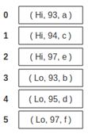
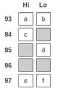

```{r setup, include=FALSE}
knitr::opts_chunk$set(echo = TRUE)

library(scidb, quietly = T)
```

# Overview and Summary of Project

Many scientific applications, such as in genomics and finance, involve performing complex linear algebraic operations, such as matrix multiplication and singular value decomposition, on massive amounts of data, often on the order of terabytes. These mathematical operations scale poorly, typically $O(n^3)$ for many linear algebraic operations, and therefore pose a significant challenge.

SciDB is a database with efficient data management and distributed architecture, designed specifically for fast mathematical and statistical operations on a massive scale. This project demonstrates the capabilities of SciDB for mathematical and statistical operations for big data, with applications to clustering analysis of movie ratings data.

Our big data application is to use [MovieLens](https://movielens.org/) ratings data to cluster users based on which similar movies they liked. We perform two clustering methods, in order to demonstrate two key linear algebra operations of SciDB:

1. Cluster using correlation: demonstrates sparse matrix multiply
1. Cluster using Principle Component Analysis: demonstrates SVD

We also use the `scidb` R package, which provides an interface between the database and R,  allowing import of data into R for visualization.

In this report, we will first describe the basic data structures and query languages of SciDB, and its installation.
Then we shown how to download and load the data into SciDB, and illustrate some basic statistical operations (e.g. avg, max).
Finally, we demonstrate the linear algebra operations in SciDB in the context of clustering analysis.


### Youtube URLs

- 2 min video:
- 15 min video:


# Introduction to SciDB

## SciDB Data Structures and Query Languages

Full documentation of SciDB is provided [here](https://paradigm4.atlassian.net/wiki/display/ESD/SciDB+Documentation).

<!-- [Array Data Model](http://paradigm4.com/HTMLmanual/13.11/scidb_ug/ch01s02.html) -->

SciDB is a computational database management system that employs the array data model. In SciDB, dataset is organized as a multi-dimensional array. A user creates a SciDB array by specifying dimensions and attributes of the array. 

An n-dimensional SciDB array has dimensions $d_1$, $d_2$, ..., $d_n$. The size of the dimension is the number of ordered values in that dimension. For example, a 2-dimensional array may have dimensions $i$ and $j$, each with values (1, 2, 3, ..., 10) and (1, 2, ..., 30) respectively.

Each combination of dimension values identifies a cell or element of the array, which can hold multiple data values called attributes ($a_1$, $a_2$, ..., $a_m$). Each data value is referred to as an attribute, and belongs to one of the supported datatypes in SciDB.





SciDB is inherently adapted to data where the elements are sitting on regular grid of one or more dimensions, such as image, geo-spatial data. Due to its matrix-like organization of data, SciDB also has good advantage in linear algebra and statistical analysis. Several system libraries for that purpose are provided in SciDB.

### AQL and AFL

SciDB provides query languages AQL, for querying the database, and AFL, for performing function calls on database objects. They are accessed from the unix terminal.

```
$ iquery
AQL% set lang AFL;
AFL%
```


### The `scidb` R package

The `scidb` R package provides an interface to R, allowing interaction with the database from R, primarily using the `iquery` function. It can be installed from github `devtools::install_github("Paradigm4/SciDBR")`

To use the `scidb` package, first load the library, and connect to the SciDB database. 

```{r}
library(scidb)
dbConnect <- scidbconnect()
```

The datasets in the SciDB database can be listed using the following command. It also illustrates the basic usage of the `iquery` function: it is told the database to connect to, and the query to run. Setting `return = T` will return the scidb arrary to an R data frame. By default, `return = F`, meaning that the query is performed in the SciDB database, but no output is returned to R.


```{r list_arrays, cache = T}
(existingArray <- iquery(db = dbConnect, query = "list('arrays')", return = T))
```


At the time of executing the query, we have 2 arrays stored in SciDB, `RATNGS` and `RATINGS_MATRIX`. From the schema, we see that `RATINGS` is a 1D array in `i` with 4 attributes `userId, movieID, rating, timestamp`, whereas `RATINGS_MATRIX` is a 2D array in `userId, movieID` with 1 attribute `rating`.


## Installation


### Method 1: SciDB's VM

Download the virtual machine from [here](insert Google Docs URL). 
The virtual machine has SciDB pre-installed, and R and RStudio server already set up with `scidb` R package installed. 
However, note that the SciDB installation has problems with MPI, preventing the use of some essential functions such as the `gesvd` for computing SVD. Also, the installed version of `scidb` R package is not the latest version.

### Method 2: Install from scratch

We install SciDB Community Edition 15.12 on a blank Ubuntu 14.04. SciDB Community Edition installation guide and reference manual is [here](https://paradigm4.atlassian.net/wiki/display/ESD/SciDB+Community+Edition+Installation+Guide)

The community edition does not have all the functionalities of SciDB. For example, the community edition does not have the truncated singular value decomposition `tsvd` in its `dense_linear_algebra` library. Functions like `tsvd` are only available in SciDB's proprietary edition. Please check the function status before using it.

SciDB requires access to the root user account on the Linux system. Ubuntu, by default, does not have a root account. Please type the following in the terminal:
```
sudo passwd root
```
and set up the root password.

The following instructions are meant for SciDB installation on one computing node acting as both the host and client, assuming the username is `scidb` and the hosting website is `127.0.0.1`. The instructions are similar to the official installation guide with several important extra steps.

#### Download SciDB Community Edition 
To download SciDB CE, do the following:

[Access the 15.12 CE page](https://drive.google.com/folderview?id=0B7yt0n33Us0rT1FJdmxFV2g0OHc&&usp=drive_web) and download the 15.12 source code tarball. Please do not just try the VM there.
```
cd /home; tar –xvzf scidb-15.12.1.4cadab5.tar.gz
```
Create a directory under the /home called scidbtrunk and install the tarball there to match the installation instructions.

#### Installing Expect, and SSH Packages
```
sudo apt-get -y install expect openssh-server openssh-client
```
#### Starting the SSH Server
Check whether ssh is running:
```
sudo service ssh status 
```
If ssh is not running, start the ssh server as follows:
```
sudo /usr/sbin/update-rc.d ssh defaults
sudo service ssh start
```
If ssh is running, restart ssh server as follows:
```
sudo service ssh restart
```
#### Providing Passwordless SSH
SciDB requires passwordless ssh on all servers logging in on each server as:

1. the `scidb` user, for starting and stopping SciDB.
2. the `root` user, for initializing SciDB on each server.

```
cd ~
ssh-keygen # DO NOT enter a passphrase; accept the default.

# Since in this case, the machine acts both the host and the client, in /home/.ssh directory, make a copy of id_rsa.pub, rename it as authorized_keys. Copy authorized_keys to /root/.ssh directory. If necessary, copy authorized_keys to all the other users on the computing cluster put in their /.ssh directories.

chmod 755 ~
chmod 755 ~/.ssh
cd /home/scidbtrunk
deployment/deploy.sh access root 127.0.0.1 <hostIP1>
deployment/deploy.sh access scidb 127.0.0.1 <hostIP1>
```
In the deploy access commands, for a single host, omit `<hostIP1>`. With more than two hosts, list all of them. This rule applies to all subsequent commands using `<hostIP1>`.
To confirm that as user `scidb` on `127.0.0.1`, you can ssh to all hosts without providing a password, run the following:
```
ssh 127.0.0.1 date
ssh <hostIP1> date
```
If you get error “Agent admitted failure to sign using the key”, search “Startup Applications Preferences” in Ubuntu, and uncheck “SSH key Agent”.

#### Installing a Single Node SciDB Instance 
SciDB implementation involves:

1. Configuring the Environment
2. Building SciDB
3. Installing SciDB

Perform the following tasks to install a single node instance of SciDB Community Edition.

#### Configuring Environment Variables
To configure your environment variables, add the following lines to your local shell configuration script (.bashrc), then source it:
```
export SCIDB_VER=15.12 
export SCIDB_INSTALL_PATH=home/scidbtrunk/stage/install
export SCIDB_BUILD_TYPE=Debug
export PATH=$SCIDB_INSTALL_PATH/bin:$PATH
```
For single node installations, do not point `SCIDB_INSTALL_PATH` at `/opt/scidb/$SCIDB_VER`. Doing so results in the deletion of all content in `SCIDB_INSTALL_PATH` (including useful packages in `/opt/scidb/$SCIDB_VER`) on installation.

Setting the `SCIDB_BUILD_TYPE` environmental variable is optional. It is used in `run.py` setup and `run.py plugin_setup`. The default value is Debug. For performance measurement, use RelWithDebInfo. See `run.py setup -h`.

Setting the `PATH` environmental variable is optional, but it is helpful to find utilities such as iquery.

#### Activating and Verifying the New .bashrc File
After saving the .bashrc file, source it, echo the environment variables, and verify the response is per the
previous settings as follows:
```
source .bashrc
echo $SCIDB_VER
echo $SCIDB_INSTALL_PATH
echo $PATH
```

#### Building SciDB CE
In this step, please allocate as much memory as possible to your VM. 4GB memory as the upper limit will not have the source code built successfully. This step is very memory and time consuming. Allocating more processing cores and invoking parallel compiling would be helpful. To build SciDB, run the following:
```
cd home/scidbtrunk
./run.py -h # to learn its usage.
./run.py setup # to configure build directories and cmake infrastructure
./run.py make -j4 # to build the sources.
```
In the `make` sub-command, use `-j4` to speedup build with 4 threads.

#### Install shim
The installation manual is [here](https://github.com/Paradigm4/shim). Refer to the section `LD_LIBRARY_PATH issues` if the following error occurs:
```
error while loading shared libraries: libscidbclient.so: cannot open shared object file: No such file or directory
```

#### Install R, Rstudio and R package `scidb`
Do not install the CRAN package “scidb”. Instead, install the package from github `devtools::install_github("Paradigm4/SciDBR")`


### Start the database

```
$ scidb.py startall mydb
```


# The Big Data Problem

We demonstrate the capabilities of SciDB on a big data problem: clustering analysis of movie ratings data from [MovieLens](https://grouplens.org/datasets/movielens/).

There are 2 datasets provided, 

- The full data set contains 27,000 movies rated by 138,000 users, with 20 million ratings.
- A small subset of the data contains about 9,000 movies rated by 671 users, with 100,004 ratings.

Each dataset is provided as a 4-column CSV file with the userID, movieID, rating, and timestamp.


The goal of this project is to perform a clustering analysis to cluster the users based on which movies they liked. The ratings is essentially a matrix, with userID for rows and movieID for columns. Due to the size of the data, the ratings matrix is huge but sparse, which means that performing matrix operations on the ratings matrix becomes a challenge. SciDB is designed precisely for such mathematical operations, and this is the meat of our demo. Specifically, for the purpose of our clustering analysis, we demo 

- sparse matrix multiplication
- singular value decomposition

on the movie ratings matrix.

Note: Due to limited disk and RAM of our laptops, we will work mainly with the small dataset, for demo purposes. In practice, SciDB boasts to be able to handle terabytes of data.


## Download data

The following script downloads the two datasets from the MovieLens website, and stores them into respective subfolders in `/home/scidb/Project`.

```{r download_data}
## Get the small dataset
data.dir <- "/home/scidb/Project/ml-latest-small" # Note: the full path is specified
if (!dir.exists(data.dir)) {
  download.file("http://files.grouplens.org/datasets/movielens/ml-latest-small.zip", 
                destfile = "/home/scidb/Project/ml-latest-small.zip")
  unzip("/home/scidb/Project/ml-latest-small.zip")
  
  # System command to strip header (first line) from data file ratings.csv
  system(sprintf("tail -n +2 %s/ratings.csv > %s/ratings_noHeader.csv", data.dir, data.dir))
}
rm(data.dir)

## Get the full dataset
data.dir <- "/home/scidb/Project/ml-20m"
if (!dir.exists(data.dir)) {
  download.file("http://files.grouplens.org/datasets/movielens/ml-20m.zip", 
                destfile = "/home/scidb/Project/ml-20m.zip")
  unzip("/home/scidb/Project/ml-20m.zip")
  
  system(sprintf("tail -n +2 %s/ratings.csv > %s/ratings_noHeader.csv", data.dir, data.dir))
}
rm(data.dir)
```


## Load Data into SciDB

Next, we load the data into the SciDB database. Because the data array is a 2D array (i.e. a matrix), whereas the data is provided as a flat array (i.e. 1D array), loading the data has two steps. We explain the steps for the small dataset. 

1. First, load the CSV file as a 1D array, named `ratings`. This is done by first creating the array, and then using the `load` function to read in the CSV file.
    
```{r load_small_dataset, eval = F, cache = T}
iquery(dbConnect, "CREATE ARRAY ratings <userId:int64, movieID:int64, rating:double NOT NULL, timestamp:int64> [i=0:?,1000000,0]")
# Note 1: It's important to make rating column NOT NULL, to enable the use of spgemm later on.
# Note 2: The 0:? allows us to create the array without knowing the size of the input file.
# Note 3: The chunk size is 1000000 and overlap is 0

iquery(dbConnect, "load(ratings, '/home/scidb/Project/ml-latest-small/ratings_noHeader.csv', -2, 'csv')")
```
    
2. The second step is to *redimension* the `ratings` array from a 1D to 2D array. The columns `userId` and `movieID` in the 1D array will become the dimensions of the 2D array. 
    
    Additionally, to be able to use subsequent functions, we need to specify the size of each dimension.
    
```{r find_size_small_dataset, eval = T, cache = T}
print(u_max <- iquery(dbConnect, "aggregate(ratings, max(userId))", return = T))
print(m_max <- iquery(dbConnect, "aggregate(ratings, max(movieID))", return = T))
```
    
    The userIds range from 1 to 671. The movieIDs range from 1 to 163949. Now, we redimension `ratings` array so that userId is the first dimension (rows) and movieID is the second dimension (columns).
    
```{r redimension_small_dataset, eval = F, cache = T}
iquery(dbConnect, "store(redimension(ratings, <rating:double NOT NULL>[userId=0:671,?,0,movieID=0:163949,?,0]), ratings_matrix)")
# Note: We start the indices from 0, not 1, to enable the use of spgemm later on.
```
    
    The `store` function stores the resulting array into a new array named `ratings_matrix`.
    
Note that even though `ratings_matrix` is a huge matrix (671 x 163949), it is very sparse.
    
```{r count_small_dataset, eval = T, cache = T}
print(n_ratings <- iquery(dbConnect, "aggregate(ratings, count(*))", return = T))
```

There are 100004 ratings available. All other entries of the matrix are zero, and not explicitly stored in the database. (In fact, according to the MovieLens data description, only 9000 movies are rated by the 700 users.)


Below is the corresponding code for loading the full dataset into SciDB. The names of the data arrays are `RATINGS` and `RATINGS_MATRIX`.

```{r load_full_dataset, eval = F, cache=T}
iquery(dbConnect, "CREATE ARRAY RATINGS <userId:int64, movieID:int64, rating:double NOT NULL, timestamp:int64> [i=0:?,1000000,0]")

iquery(dbConnect, "load(RATINGS, '/home/scidb/Project/ml-20m/ratings_noHeader.csv', -2, 'csv')")

U_max <- iquery(dbConnect, "aggregate(RATINGS, max(userId))", return = T)$userId_max
M_max <- iquery(dbConnect, "aggregate(RATINGS, max(movieID))", return = T)$movieID_max

query <- sprintf("redimension(RATINGS, <rating:double NOT NULL>[userId=0:%d,?,0,movieID=0:%d,?,0])",
                 U_max, M_max)
iquery(dbConnect, sprintf("store(%s, RATINGS_MATRIX)", query)
```

## Essential statistics using SciDB

We show some essential statistical methods using SciDB functions.

What is the average rating given by each user?

```{r}
userAvg <- iquery(dbConnect, "aggregate(ratings_matrix, avg(rating), userId)", return = T)
head(userAvg)
```

Similarly, we can obtain the highest rating received by each movie.

```{r}
movieAvg <- iquery(dbConnect, "aggregate(ratings_matrix, max(rating), movieID)", return = T)
head(movieAvg)
```

A note of caution, the averages are computed only on non-zero ratings.

Other aggregation functions include `sum`, `min`, `max`, `stdev`, etc.


# Clustering Users in the Small Dataset

Using the small dataset, we'll cluster users in 2 ways:

1. Compute pairwise correlation (over movieIDs) between users. Apply hierarchical clustering on the correlation matrix.
1. Compute the SVD of the ratings matrix and keep the top 10 singular values. Apply hierarchical clustering on the top singular component coefficients.

The correlation matrix and SVD will be computed using SciDB functionality, while hierarchical clustering and visualizations will be performed in R.

## Clustering using the correlation matrix

Now, let's to compute the correlation between users, which is $M*M^T$, where $M$ is the row-normalized ratings matrix. In practice, because normalization changes the ratings matrix from sparse to dense, what's usually done is to 

1. sparse matrix multiply the unnormalized ratings matrix
1. account for the normalization by subtracting and dividing, element-wise, the corresponding products of means and standard deviations


The SciDB function for sparse matix multiply is `spgemm`, in the `linear_algebra` library.

```{r load_linear_algebra_library}
iquery(dbConnect, "load_library('linear_algebra')")
```


```{r spgemm_small_data, eval=F}
iquery(dbConnect, "store(spgemm(ratings_matrix, transpose(ratings_matrix)), ratings_matrix_MxMT)")
```

The next code chunk accounts for the normalization.

```{r convert2correlationMatrix_small_data, eval = F}
# Average user rating
query_userAvg <- "apply(aggregate(ratings_matrix, sum(rating), userId), rating_avg, rating_sum/163949.0)"
iquery(dbConnect, sprintf("store(project(%s, rating_avg), ratings_userAvg)", query_userAvg))

# Mean sum of square ratings
query_rating_sq <- "apply(ratings_matrix, rating_sq, rating * rating)"
query_rating_MSS <- sprintf("apply(aggregate(%s, sum(rating_sq), userId), rating_MSS, rating_sq_sum/163949.0)",
                            query_rating_sq)
iquery(dbConnect, sprintf("store(project(%s, rating_MSS), ratings_userMSS)", query_rating_MSS))

# Cross join with ratings matrix
query_crossjoin <- "cross_join(ratings_matrix_MxMT as A, ratings_userAvg as B, A.userId, B.userId)"
query_crossjoin <- sprintf("cross_join(%s as A, ratings_userAvg as B, A.userId2, B.userId)", 
                           query_crossjoin)
query_crossjoin <- sprintf("cross_join(%s as A, ratings_userMSS as B, A.userId, B.userId)",
                           query_crossjoin)
query_crossjoin <- sprintf("cross_join(%s as A, ratings_userMSS as B, A.userId2, B.userId)",
                           query_crossjoin)
iquery(dbConnect, sprintf("store(%s, ratings_crossjoin)", query_crossjoin))

# Compute correlation matrix from M*M^T
query <- "apply(ratings_crossjoin, correlation, 
(multiply/163949.0 - rating_avg * rating_avg_2) / 
sqrt((rating_MSS - pow(rating_avg, 2)) * (rating_MSS_2 - pow(rating_avg_2, 2))))"

iquery(dbConnect, 
       sprintf("store(project(%s, correlation), ratings_correlationMatrix)", query))
```

Finally, we import the correlation matrix into R, for clustering and visualization.
```{r retrieve_correlationMatrix, cache = T}
correlationMatrix <- iquery(dbConnect, 
                            "filter(ratings_correlationMatrix, TRUE)", 
                            return = T)

library(Matrix, quietly = T)
correlationMatrix <- spMatrix(nrow = 671, ncol = 671, 
                              i = correlationMatrix$userId, 
                              j = correlationMatrix$userId2,
                              x = correlationMatrix$correlation)
```

We visualize the correlation matrix using the `heatmap` function in R. This function also automatically computes the dendrogram and reorders the rows and columns to produce a visual clustering of the userIds. (Actually, we'll visualize `1-correlationMatrix`, which is the dissimilarity matrix.)

```{r heatmap_correlationMatrix, cache = T}
heatmap(as.matrix(1 - correlationMatrix), symm = T, xlab = "userId", ylab = "userId")
```

### Hierarchical clustering

We now perform hierarchical clustering on the dissimilarity matrix `1-correlationMatrix`.
```{r hclust_correlationMatrix, cache = T}
hc <- hclust(as.dist(1 - correlationMatrix))
plot(hc)
```


## Clustering using Principle Component Analysis and the SVD

In this clustering approach, we'll perform the SVD on the ratings matrix to obtain the top princple components of the ratings matrix. The SVD decomposed the ratings matrix into $M = U*S*V^T$.

SciDB provides the `gesvd` function in the `dense_linear_algebra` library, for computing the SVD of a dense matrix. To use this function, first load the library.

```{r load_dense_linear_algebra_library}
iquery(dbConnect, "load_library('dense_linear_algebra')")
```

Next, we center the data at 0, a requirement of the PCA. 

```{r center_small_data, eval = F}
query_userSum <- "aggregate(ratings_matrix, avg(rating), movieID)"
query_crossjoin <- sprintf("cross_join(ratings_matrix as A, %s as B, A.movieID, B.movieID)", 
                           query_userSum)
query_center <- sprintf("project(apply(%s, rating_centered, rating-rating_avg), rating_centered)", 
                        query_crossjoin)

ratings_matrix_centered <- iquery(dbConnect, 
                                  sprintf("store(%s, ratings_matrix_centered)", query_center), 
                                  return = T)
```

Now, we are ready to compute the singular values of the ratings matrix.


```{r gesvd_small_data, eval = F, cache = T}
ratings_singularValues <- iquery(dbConnect, 
                                 "store(gesvd(ratings_matrix_centered, 'S'), ratings_singularValues)")
save(ratings_singularValues, file="/home/scidb/Project/ratings_singularValues.Rdata")
```

By inspecting the plot of the singular values, we see that the top 3 singular values capture a large amount of variation in the data.

```{r plot_singularValues, eval = T, cache = T}
load("/home/scidb/Project/ratings_singularValues.Rdata")

## For logistical reasons, we have saved the SVD results as Rdata format. 
## Equivalently, the singular values can be retrieved from the SciDB database
## using the following command:
# ratings_singularValues <- iquery(dbConnect, "filter(ratings_singularValues, TRUE)", return = T)

plot(ratings_singularValues)
```


We also need the singular vectors. 

```{r gesvd_U_small_data, eval = F, cache = T}
iquery(dbConnect, "store(gesvd(ratings_matrix_centered, 'U'), ratingsSvdU)")
```

To obtain the principle component directions, we need to compute $U * S$, performed in SciDB as follows.

```{r gesvd_UxSdiag_small_data, eval = F}
iquery(dbConnect, "store(apply(ratings_singularValues, j, i), tmpDb)")
iquery(dbConnect, "store(redimension(tmpDb, <sigma:double NOT NULL>[i=0:671,?,0,j=0:671,?,0]), ratingsSvdSdiag)")
iquery(dbConnect, "remove(tmpDb)")

iquery(dbConnect, "store(spgemm(ratingsSvdU, ratingsSvdSdiag), ratingsSvdUxS)")
```

We'll extract only the first 3 singular vectors into R for visualization


```{r ratingsSvdUxSfirst3, eval = F}
ratingsSvdUxSfirst3 <- iquery(dbConnect, "subarray(ratingsSvdUxS, 0, 0, 671, 2)", return = T)
ratingsSvdUxSfirst3$userId <- as.integer(ratingsSvdUxSfirst3$userId)
ratingsSvdUxSfirst3$j <- as.integer(ratingsSvdUxSfirst3$j)
save(ratingsSvdUxSfirst3, file = "/home/scidb/Project/ratingsSvdUxSfirst3.Rdata")
```

The first 3 PC coordinates are shown below.
```{r PCcoords, cache = T}
load("/home/scidb/Project/ratingsSvdUxSfirst3.Rdata")

library(Matrix)
PCcoords <- spMatrix(nrow = 671, ncol = 3, 
                     i = ratingsSvdUxSfirst3$userId, 
                     j = ratingsSvdUxSfirst3$j + 1, 
                     x = ratingsSvdUxSfirst3$multiply)
# The +1 is due to difference in 0-indexing in SciDB and 1-indexing in R

plot(as.data.frame(as.matrix(PCcoords)))
```

Note: SciDB has a paid Enterprise Edition with added functionality, such as truncated SVD. In most applications, only the top few singular values are required, so truncated SVD is more efficient than computing the entire SVD. However, we do not have access to that function in the SciDB Community Edition.


### Hierarchical clustering using PCA

We'll use just the top 3 PC coordinates for clustering. This yields the following clustering results.

```{r SVD_heatmap, cache=T}
d <- dist(PCcoords)
heatmap(as.matrix(d), symm = T)
```


```{r SVD_hc, cache=T}
hclustTree <- hclust(d)
plot(hclustTree)
```


